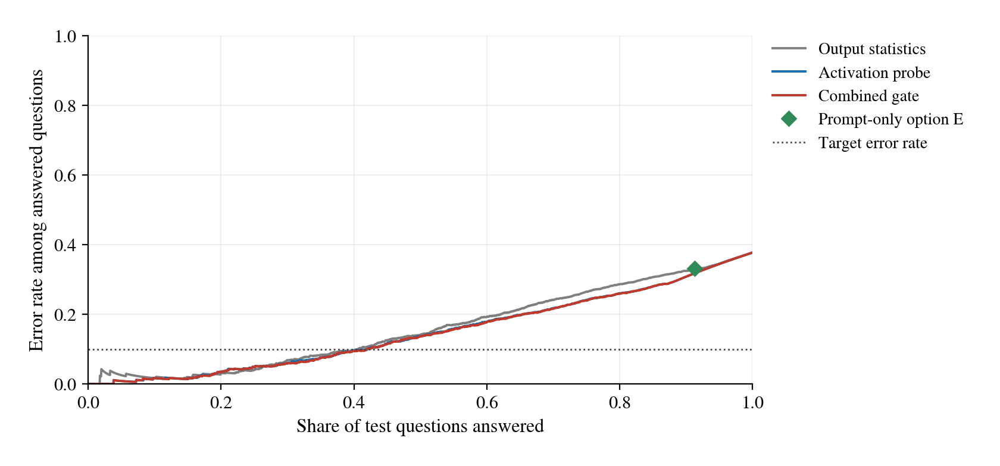
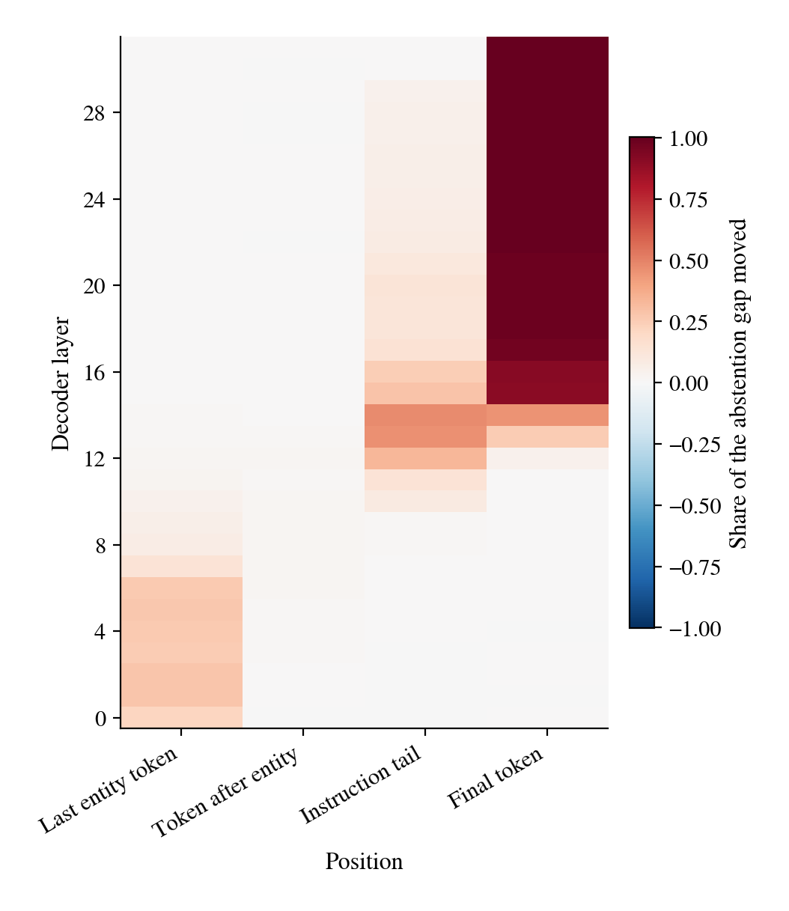
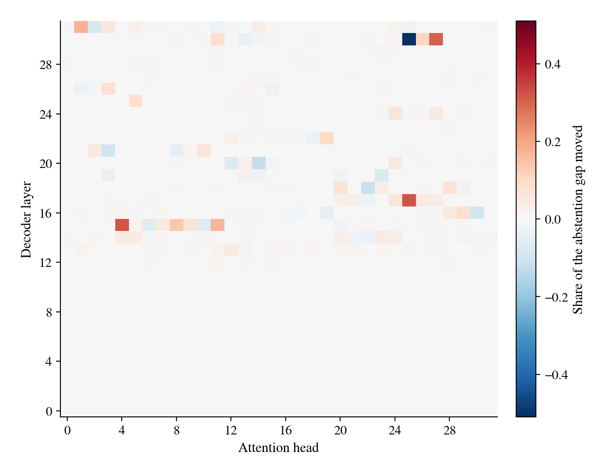
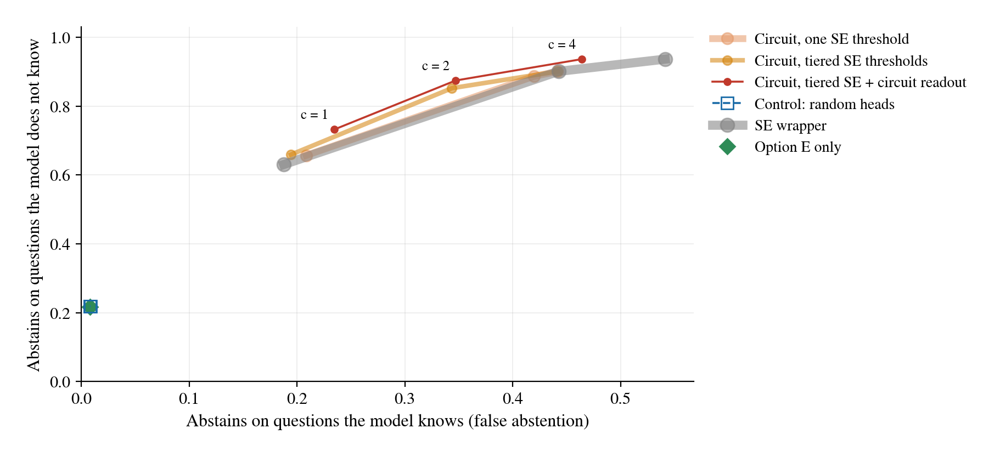

# Abstention on health questions in Llama 3.1 8B Instruct: a certified gate, an abstention circuit and semantic-entropy steering

Report on the experiments run from 18 to 19 September 2026 under `uncertainty-mech-interp/code`. All numbers come from the run directories listed in Appendix B.

## Executive summary

We tested whether a language model can be made to reply "I don't know" to health questions it would otherwise answer incorrectly. The model was Llama 3.1 8B Instruct. The questions were 10,000 MedQA exam questions and 1,500 questions about invented drugs and diseases, for which every answer is wrong.

1. **A certified external gate met its target on held-out data.** A logistic probe on internal activations, calibrated and certified on separate data, answered 31.2% of 2,388 test questions and was wrong on 5.9% of those answers. Without the gate, 37.7% of answers were wrong. The one-sided 95% upper bound on the error rate of released answers was 7.5%, below the 10% target. All 297 invented-entity questions were refused.
2. **The model's own abstention is associated with entity familiarity.** When "I don't know" was offered as option E, it was chosen for 63% of invented-entity questions and for 2% of real questions answered incorrectly. Semantic entropy was similar in the two groups (median 0.74 and 0.75 nats).
3. **Two attention heads account for about half of the abstention signal.** Copying the outputs of heads L15.H4 and L17.H25 from an invented-entity prompt into the matched real-entity prompt moved 51.0% of the abstention gap on 99 held-out pairs. Random pairs of heads moved -1.9%. The same patch changed semantic entropy by 0.001 nats.
4. **Semantic entropy can be used to activate these heads, and tiered thresholds improve the result when wrong answers are costly.** With one threshold, the error rate among answers fell from 33.0% to 21.3% and invented-entity refusal rose from 60.6% to 86.9%. On real questions the result was equal to that of a semantic-entropy threshold applied outside the model. With up to three thresholds and a trigger based on the heads' own activations, utility rose by 0.046 [0.020, 0.071] at a wrong-answer cost of 4. Abstention on unknown questions was unchanged, and false abstention fell by 7.7 percentage points. At a cost of 1, no difference was detected.

The results hold for one model, one multiple-choice format and one benchmark. They are not medical advice.

## 1. Introduction

On 2,388 held-out health questions, Llama 3.1 8B Instruct answered 91.3% when the option "I don't know" was available, and 33.1% of those answers were wrong (Table 2). In a health setting a wrong answer can cause harm, whereas "I don't know" introduces no false information. This work implements and tests the research design in `../uncertainty-mech-interp/` (RFC Version 1.3 and `protocol.md`). That design proposes to detect likely errors from internal activations and to release an answer only below a calibrated risk threshold.

Three research questions were addressed.

- **RQ1.** Can an activation-based gate release answers only when they are likely correct, with a statistical guarantee on held-out questions?
- **RQ2.** Which internal components produce the model's own "I don't know" response, and how are they related to semantic entropy?
- **RQ3.** Can semantic entropy be used to activate those components, so that the model itself abstains on questions it does not know? Do several thresholds improve on one?

The work proceeded in four experiments. Experiment 1 built and certified an external gate. Experiment 2 located the components that produce abstention, using activation patching. Experiment 3 activated those components when semantic entropy was high. Experiment 4 replaced the single threshold with tiered thresholds and added a trigger based on the circuit's own activations.

## 2. Methodology

### 2.1 Model and data

**Model.** The RFC specifies Gemma 2 2B. That checkpoint is gated for the account used and returned HTTP 403, so Llama 3.1 8B Instruct (revision `0e9e39f2`) was used instead. The model ran in bfloat16 on one A100 80 GB GPU.

**Question format.** Every question had four options, A to D. The answer was read from one forward pass, as the next-token probabilities of the letters A to D after the chat template. This makes grading exact and removes the need for a judge model. In a second prompt variant, option E ("I don't know") was added, and the model's choice of E is its own abstention.

**Real questions.** MedQA-USMLE four-option questions (Jin et al., 2021), training file, pinned revision. Questions were deduplicated by normalized text, leaving 10,176 unique questions, and sampled with seed 17.

**Invented questions.** Names of drugs and diseases were generated from syllables. Names containing real drug-class stems (for example -pril, -statin, -mab) or any word in the MedQA text were rejected. Each invented entity received three clinical questions, for example "A 64-year-old woman is started on Velquarin. What is the usual adult starting dose of this drug?". The options are real drugs, genes, organisms, enzymes or doses. Every substantive answer to an invented question is counted as an error.

**Data roles.** Questions were grouped. A real question forms its own group, and an invented entity's three questions form one group. Whole groups were assigned by a seeded hash to four roles. The roles were discovery (fitting and circuit search), `cal_prob` (probability calibration and steering settings), `cal_gate` (threshold certification) and test (one final evaluation). For binomial bounds, one canonical question per group was used, chosen before any model output existed.

**Matched pairs.** For Experiments 2 to 4, 75 well-established health facts were written in the same templates, for example the mechanism of atorvastatin or the gene mutated in Marfan syndrome. Each fact was paired with three invented names in an otherwise identical prompt with the same options in the same order. This gave 225 pairs. Pairs were split by real entity, with 60% of entities assigned to discovery (126 pairs) and the rest to test (99 pairs), so that no test entity was used to find the circuit. The model answered all 225 real questions correctly under forced choice.

### 2.2 Measures

- **Semantic entropy (SE)** is the entropy of the model's answer distribution over meanings (Farquhar et al., 2024). In multiple choice each letter is one meaning, so SE = -Σ p_i ln p_i over the letters A to D. It is computed exactly, without sampling. The maximum is ln 4 = 1.386 nats. Unless stated otherwise, SE is taken from the prompt without option E ("forced choice").
- **Abstention gap** = ln P(E) - ln P(A or B or C or D), on the prompt with option E. Positive values mean that "I don't know" is preferred.
- **Known and unknown questions** are operational labels. A known question is a real question answered correctly under forced choice. An unknown question is an invented-entity question or a real question answered incorrectly under forced choice.
- **Restoration** R measures a patch from a source prompt into a target prompt. R = (mean patched metric - mean target metric) / (mean source metric - mean target metric). R = 1 means that the patched target behaves like the source.
- **Utility** at wrong-answer cost c = (right answers - c × wrong answers) / questions. "I don't know" scores 0. The cost c is the loss from one wrong answer relative to the gain from one right answer.

### 2.3 Experiment 1: certified external gate

At the last prompt token, the output of every decoder layer (the residual stream) was captured with forward hooks. A logistic probe predicted whether the chosen answer was wrong. On discovery data, grouped 5-fold cross-validation selected the probe layer and the regularization strength. Three risk models were compared. They used output statistics (top probability, top-two margin, SE, probability mass on the letters), the activation probe, or both combined; the combined model was fixed in advance as the primary gate. A single temperature was fitted on `cal_prob` to calibrate the risk.

On `cal_gate`, each of 20 fixed thresholds received a one-sided Clopper-Pearson upper bound (Clopper and Pearson, 1934) on the error rate of the answers it would release. The significance level was 0.05/20, a Bonferroni split over the threshold grid, following Learn then Test (Angelopoulos et al., 2021). Among thresholds whose bound was at most 10%, the one releasing the most answers was selected. If none passed, the gate answered nothing. The frozen gate was then applied once to the test role.

The target of 10% was fixed before any model output was seen. We judged the RFC's 5% target to require more low-risk calibration questions than the first planned sample provided. A first run with 4,600 questions served as a pilot (Section 3.2). A second run used all 10,000 MedQA questions and 500 invented entities, with 30% of groups assigned to `cal_gate`. The regularization grid was also extended from 0.01 down to 0.0001, because the pilot selected the smallest value in its grid. The target, threshold grid, significance level and primary gate were not changed. The changes and their reasons are recorded in the run configuration and the design document.

### 2.4 Experiment 2: locating the abstention circuit

All patches used the prompt with option E and read the abstention gap and SE from the same forward pass. Positions were counted from the end of the prompt, so that the two prompts of a pair align even when the names differ in length.

1. **Residual stream by layer and position.** The residual stream was copied from the invented prompt into the real prompt at one layer and one of four positions. The positions were the last token of the entity name, the token after it, the shared instruction tail, and the final token.
2. **Attention heads at the final token.** The output of one head (its slice of the input to the attention output projection) was copied, for all 32 × 32 = 1,024 heads.
3. **MLP outputs at the final token**, for all 32 layers.

Heads were ranked by single-head restoration. The circuit was defined as the smallest top-k set (k in 1, 2, 4, 8, 16, 32) whose joint patch reached R ≥ 0.5 on discovery pairs. On test pairs, the circuit was compared with five random head sets of the same size, in both directions. "Invented into real" tests sufficiency; "real into invented" tests necessity.

### 2.5 Experiment 3: semantic-entropy steering of the circuit

For each circuit head, a steering vector was computed as the mean head output on invented prompts minus the mean on real prompts, over discovery pairs. Steering added dose × vector to each circuit head at the final token, on the prompt with option E. The reply is the model's own letter.

Seven conditions were compared on MedQA and invented questions from the second run:

1. option E only;
2. an SE wrapper, which replies "I don't know" when forced-choice SE exceeds a threshold and otherwise uses the model's letter;
3. SE-gated steering (steer only above a threshold);
4. SE-scaled steering (dose proportional to SE);
5. steering on every question;
6. SE-gated steering with mean-difference vectors at random heads;
7. SE-gated steering with norm-matched random vectors at the circuit heads.

Dose (1, 2, 4 or 8) and threshold (0.1 to 1.3 nats) were chosen on `cal_prob` by net correct answers (utility at c = 1) and scored once on the test role (2,388 questions).

### 2.6 Experiment 4: tiered semantic-entropy steering with a circuit readout

A tiered schedule maps SE to a dose. Up to three increasing thresholds t1 < t2 < t3 (from 0.2, 0.4, ..., 1.2 nats) receive non-decreasing doses d1 ≤ d2 ≤ d3 (from 0.5, 1, 2, 4, 8). A question with SE above tk is steered at dose dk.

A second trigger uses the circuit readout. The readout is the sum, over the two circuit heads, of the projection of the head output onto the unit steering direction, measured in the unsteered pass. When the readout exceeds a threshold (the 50th, 75th, 90th or 95th percentile of calibration readouts), the dose is raised to at least a readout dose.

The model was run once per dose. Any schedule was then scored exactly by taking each question's letter from the pass at its assigned dose, since prompts in a batch do not interact. For each wrong-answer cost c in {1, 2, 4}, 20,055 candidate schedules were scored on `cal_prob`. The best schedule was recorded within each of three nested families. The families were one threshold, up to three thresholds, and up to three thresholds with the readout trigger. An SE wrapper was also chosen for each cost. All were scored once on the test role. The random-head control applied the chosen tiered-with-readout schedule to the random heads of Experiment 3. Differences between controllers were estimated on the same test questions, with 95% intervals from 2,000 bootstrap resamples of question groups.

### 2.7 Software and verification

The code follows a layered design. The domain layer contains the question model, splits, prompts, metrics, the certificate and the dose schedule, and has no model or file dependencies. The application layer contains the use cases and the interfaces (ports) they call. The infrastructure layer contains the Hugging Face model adapter with hooks, the data sources, the file store and the figures. Only the model adapter imports PyTorch.

Twelve end-to-end tests run every command on fake models. One fake is a four-layer model with a planted abstention head. The tests check that the circuit search ranks that head first, that the circuit exceeds random heads, and that steering changes only the intended questions. GPU smoke runs preceded each full run. The smoke run of Experiment 1 exposed one defect. Questions were sampled with the same hash that assigns roles, so all sampled questions fell into discovery. Sampling was given a separate hash, and a test for role balance was added. Recomputed passes differ from saved readings by up to 0.4 in log-probability, with identical answer letters. This difference arises from bfloat16 arithmetic under different batch padding.

## 3. Results

### 3.1 Baseline behavior

**Table 1.** Semantic entropy and choice of option E on all 11,500 questions of the second run.

| Question type | n | Median SE (nats) | Chooses "I don't know" when offered |
|---|---|---|---|
| Real, answered correctly | 7,113 | 0.13 | 0% |
| Real, answered incorrectly | 2,887 | 0.75 | 2% |
| Invented entity | 1,500 | 0.74 | 63% |

MedQA accuracy under forced choice was 71.1% on the test role. SE separated correct from incorrect real answers. The choice of option E did not separate them; it occurred on 63% of invented-entity questions and on 2% of incorrect real answers. Offering option E changed little on real questions. It was chosen for 1.3% of real test questions, and 29.4% of the remaining answers were wrong.

### 3.2 Experiment 1: certified external gate

**Pilot.** With 4,600 questions (4,000 MedQA, 600 invented), `cal_gate` contained 427 independent questions. No threshold was certified; the lowest upper bound was 15.9%. Following the protocol, the pilot gate answered no questions.

**Second run.** With 11,500 questions, `cal_gate` contained 3,148 independent questions. The probe was most informative at layer 19 (discovery AUROC 0.830, rising from 0.70 at layer 0 and flat above layer 18). All three gates were certified at threshold 0.15.

**Table 2.** Test results of the second run (2,388 questions, of which 2,091 MedQA and 297 invented). Upper bounds treat every question as independent.

| Method | Answered | Wrong among answered | 95% upper bound | Right answers kept | Invented refused |
|---|---|---|---|---|---|
| No gate | 2,388 | 37.7% | 39.4% | 100% | 0% |
| Option E offered | 2,180 | 33.1% | 34.8% | 98.0% | 60.9% |
| Gate on output statistics | 706 | 6.4% | 8.1% | 44.5% | 94.9% |
| Gate on activation probe | 744 | 6.5% | 8.1% | 46.8% | 100% |
| Combined gate (primary) | 745 | 5.9% | 7.5%* | 47.1% | 100% |

\* All answers released by the combined gate are MedQA questions, each forming its own group, so this bound also holds on the 2,190 independent test units.

On real questions only, the activation probe did not rank errors better than output statistics. Test AUROC was 0.781 for the probe, 0.783 for the combined model and 0.796 for output statistics. Pooled over real and invented questions, the activation-based models ranked errors better (AUROC 0.853 and 0.854 against 0.825). The pooled advantage comes from the ranking of invented against real questions; both activation-based gates refused all 297 invented questions. After the run, the calibration table showed that threshold 0.07 would also have met a 5% target (588 of 3,148 calibration questions answered, 14 wrong, bound 4.7%). This was not tested on the test role.

*Figure 1. Error rate among answered test questions against the share answered, for the three gates. The error rate stays below the 10% target line for coverage up to about 0.4. Option E offered corresponds to one point at 91% coverage and 33% error.*

**Single-direction steering.** In the same run, the mean activation difference between wrong and right answers at layer 19 was added at every position. It did not raise the probability of E above the value obtained with random directions of equal norm (0.084 at four times the class difference, against 0.093 for random directions). It lowered MedQA accuracy from 67.6% to 55.3%.

### 3.3 Experiment 2: the abstention circuit

**Baseline on pairs.** The real prompts never led to a choice of E (abstention gap -13.6 on discovery pairs). The invented prompts led to E in 54.8% of discovery pairs and 76.8% of test pairs.

**Residual stream.** The effect of patching moved from the entity to the final token across layers (Figure 2). At the last entity token, patching moved 21% to 28% of the gap at layers 0 to 6, 7% at layer 8 and at most 4% from layer 10. In the shared instruction tail, the effect rose from 9% at layer 10 to 47% at layer 14 and fell to 25% at layer 16. At the final token, it was 4% at layer 12, 45% at layer 14, 91% at layer 15 and 98% at layer 18.

*Figure 2. Share of the abstention gap moved by copying the residual stream from the invented prompt into the real prompt, by layer and position (126 discovery pairs). The effect is located at the entity in layers 0 to 7, mainly in the instruction tail in layers 12 to 16, and at the final token from layer 14.*

**Heads and MLPs.** Single heads L15.H4 and L17.H25 each moved 32% of the gap, and L30.H27 moved 31% (Figure 3). Head L30.H25 moved -51%, so copying its invented-prompt output made the real prompt less likely to abstain. The largest MLP effects at the final token were at layers 16 (36%), 29 (33%) and 28 (27%).

*Figure 3. Share of the abstention gap moved by copying one attention head's output at the final token (126 discovery pairs). Effects are confined to layers 13 to 31; L15.H4 and L17.H25 are the two largest positive effects and L30.H25 the largest negative effect.*

**Circuit size.** Joint patches of the top-ranked heads moved 32.0% (k = 1), 52.1% (k = 2), 73.3% (k = 4), 91.6% (k = 8) and 99.2% (k = 32) of the gap on discovery pairs. The circuit is the two heads L15.H4 and L17.H25.

**Table 3.** Circuit validation on 99 held-out pairs.

| Patch | Circuit (2 heads) | Random sets of 2 heads (mean, range of 5) | Change in SE (circuit) | Chooses E after patch (circuit) |
|---|---|---|---|---|
| Invented into real (sufficiency) | 51.0% | -1.9% (-9.4% to 0.2%) | +0.001 nats | 1.0% |
| Real into invented (necessity) | 21.0% | -0.2% (-1.1% to 0.1%) | -0.094 nats | 25.3% (from 76.8%) |

The circuit patch moved half of the gap in the sufficiency direction but did not by itself produce a choice of E. In the necessity direction, it lowered the choice of E from 76.8% to 25.3%; random heads left it between 75.8% and 78.8%. The circuit patch changed SE by 0.001 nats.

### 3.4 Experiment 3: semantic-entropy steering

**Table 4.** Test results of steering (2,388 questions). Settings were chosen on `cal_prob` at c = 1.

| Condition | Answered | Wrong among answered | Right answers kept | Invented refused | Net correct |
|---|---|---|---|---|---|
| Option E only | 91.3% | 33.0% | 98.3% | 60.6% | 0.311 |
| SE wrapper (SE > 0.7) | 64.5% | 21.9% | 80.9% | 73.4% | 0.362 |
| SE-gated steering (SE > 0.2, dose 1) | 62.2% | 21.3% | 78.6% | 86.9% | 0.357 |
| SE-scaled steering (dose 2 × SE / ln 4) | 63.4% | 21.1% | 80.4% | 83.8% | 0.366 |
| Steering on every question (dose 1) | 60.2% | 20.9% | 76.5% | 92.3% | 0.351 |
| Random heads, same gate | 91.3% | 33.0% | 98.2% | 60.9% | 0.310 |
| Random vectors at circuit heads, same gate | 90.2% | 32.7% | 97.5% | 64.3% | 0.312 |

Circuit steering increased abstention; both controls left the results at the level of option E alone. Among real questions above the gate, steering at dose 1 changed 60.1% of the incorrect answers (n = 531) and 46.1% of the correct answers (n = 646) into E. On calibration questions, at doses of 4 and above every gated answer became E, and the result equalled the SE wrapper at the same threshold. At the operating points chosen on calibration data, the two differed by 2.3 points of coverage and 0.6 points of error (Table 4).

### 3.5 Experiment 4: tiered steering with a circuit readout

The circuit readout separated invented from real test questions with AUROC 0.994. It separated incorrect from correct answers on real questions with AUROC 0.646.

**Table 5.** Controllers chosen on `cal_prob` and their test results. In a schedule, the number after each colon is the dose; "E" means that the wrapper replies "I don't know". "Unknown" and "known" are defined in Section 2.2.

| Cost c | Controller | Chosen schedule | Abstains on unknown | Abstains on known | Invented refused | Utility |
|---|---|---|---|---|---|---|
| 1 | SE wrapper | SE > 0.7: E | 63.0% | 18.8% | 73.4% | 0.362 |
| 1 | Tiered + readout | SE > 0.2: 0.5; > 0.6: 1; > 0.8: 2; readout > 2.24: 4 | 73.3% | 23.5% | 98.3% | 0.371 |
| 2 | SE wrapper | SE > 0.2: E | 90.1% | 44.3% | 89.6% | 0.273 |
| 2 | One threshold | SE > 0.2: 2 | 88.7% | 42.0% | 89.6% | 0.276 |
| 2 | Tiered | SE > 0.2: 1; > 0.4: 2; > 0.6: 4 | 85.2% | 34.4% | 88.6% | 0.295 |
| 2 | Tiered + readout | SE > 0.2: 0.5; > 0.4: 2; > 0.6: 4; readout > 2.24: 4 | 87.5% | 34.7% | 98.7% | 0.307 |
| 4 | SE wrapper | SE > 0.1: E | 93.7% | 54.1% | 91.9% | 0.190 |
| 4 | One threshold | SE > 0.2: 4 | 90.1% | 44.2% | 89.6% | 0.196 |
| 4 | Tiered + readout | SE > 0.2: 4; readout > 2.24: 4 | 93.7% | 46.4% | 99.0% | 0.236 |
| any | Option E only | | 21.6% | 0.8% | 60.6% | |

At c = 4, the tiered search selected a single threshold, so "tiered" equals "one threshold" in that row. The random-head control stayed at the level of option E alone for every cost (utility 0.308, 0.005 and -0.597 for c = 1, 2 and 4).

**Table 6.** Paired differences between controllers on the test role, with 95% group-bootstrap intervals. Abstention differences are in percentage points.

| Cost c | Comparison | Utility | Abstains on unknown | Abstains on known |
|---|---|---|---|---|
| 1 | Tiered + readout vs SE wrapper | +0.008 [-0.008, +0.025] | +10.2 [+7.3, +13.1] | +4.7 [+3.2, +6.3] |
| 2 | Tiered + readout vs SE wrapper | +0.034 [+0.014, +0.053] | -2.7 [-4.7, -0.6] | -9.5 [-11.5, -7.8] |
| 2 | Tiered vs one threshold | +0.019 [+0.005, +0.033] | -3.4 [-4.9, -2.0] | -7.6 [-9.1, -6.1] |
| 4 | Tiered + readout vs SE wrapper | +0.046 [+0.020, +0.071] | +0.0 [-1.5, +1.5] | -7.7 [-9.3, -6.1] |
| 4 | Tiered + readout vs one threshold | +0.040 [+0.021, +0.060] | +3.6 [+2.4, +4.8] | +2.2 [+1.5, +3.0] |

*Figure 4. Abstention on unknown test questions against abstention on known test questions, for each controller at c = 1, 2 and 4. Tiered steering with the circuit readout lies above the SE wrapper at every cost; at c = 4 it reaches the same abstention on unknown questions (93.7%) with 7.7 points less false abstention.*

By SE band at c = 2, the tiered controller with the readout abstained on 40.6% of unknown and 4.0% of known questions with SE below 0.2 nats. SE-only methods abstained on 7.3% of unknown questions in that band. Between 0.2 and 0.6 nats, the controller abstained on 72.9% of unknown and 44.3% of known questions. Above 0.6 nats it abstained on all questions.

## 4. Discussion

**Answer uncertainty and entity familiarity.** The results indicate that answer uncertainty and entity familiarity are represented separately in this model. SE separated correct from incorrect real answers (median 0.13 against 0.75 nats). The model's own abstention was associated with familiarity (63% for invented entities, 2% for incorrect real answers). Patching the circuit moved half of the abstention gap and changed SE by 0.001 nats. The circuit readout separated invented from real entities (AUROC 0.994) but only weakly separated incorrect from correct real answers (AUROC 0.646). This pattern is consistent with the familiarity hypothesis proposed by Lindsey et al. (2025). It is also consistent with the small effect of offering option E on real questions (1.3% abstention, 29.4% error).

**Location of the signal.** The residual-stream results follow the pattern reported for factual recall by causal tracing (Meng et al., 2022). The relevant state is located at the entity token in early layers (up to 28% at layers 0 to 6) and at the final token from the middle layers (91% at layer 15). It is also present in the instruction tail (47% at layer 14). Final-token patching was used here, so the route from the entity to the tail was not traced head by head. The negative head L30.H25 resembles the negative heads described in circuit analyses of GPT-2 small (Wang et al., 2023). Its function was not tested further.

**External gate and internal steering.** The certified gate of Experiment 1 gave the lowest error among answered questions (5.9%), at 31.2% coverage and with a held-out bound. Circuit steering in Experiments 3 and 4 operated at higher coverage (58% to 62% at c = 1) and higher error (18% to 21%). The two approaches optimize different objectives, a certified risk bound and an expected utility, and are not directly comparable. The advantage of steering is that the model's own output becomes "I don't know". With one threshold, steering gave no gain over applying the same threshold outside the model. A gain appeared with graded doses and with the readout trigger, and only at wrong-answer costs of 2 and 4. At dose 1, incorrect answers were changed to E more often than correct ones (60.1% against 46.1%). The probability of a change to E depended partly on whether the unsteered answer was correct.

**Calibration sample size.** The pilot showed that 427 calibration units could not certify 10% with a Bonferroni correction over 20 thresholds, even though the low-risk region had an observed error of 2.6% (1 of 39). With 3,148 units, the 10% target was met and a 5% target appeared reachable. This agrees with the RFC's estimate that at least 117 error-free accepted cases are required for a 5% bound.

**Limitations.**

- One model, one multiple-choice prompt format and one benchmark were used. Free-text answers would require new calibration and a semantic clustering step for SE.
- The second run was designed after the pilot and shares questions with it. It is classed as a larger test run; a confirmatory study would require fresh questions.
- Invented names differ from real names in familiarity and in form (real drug names contain class suffixes). The pairs cannot separate the two factors.
- Steering vectors were derived from templated pairs and applied to MedQA prompts. The transfer was measured for this format only.
- In Experiment 4, 20,055 schedules were compared on 1,202 calibration questions. Calibration utilities are optimistic. Test results are held out and are reported with intervals.
- MedQA is public and may be present in pretraining data.
- Gemma 2 was replaced by Llama 3.1 8B, so the RFC's Gemma Scope dictionaries were not used. Sparse-autoencoder analysis, path patching and TruthfulQA transfer were out of scope.

## 5. Conclusion

- **RQ1.** An activation-based gate met a 10% risk target with a held-out bound of 7.5%, once 3,148 calibration units were available. It answered 31.2% of test questions and refused all invented-entity questions. On real questions, the activation probe did not rank errors better than output statistics.
- **RQ2.** The model's "I don't know" response is associated with entity familiarity and is produced in part by attention heads L15.H4 and L17.H25. These heads account for 51.0% of the abstention gap on held-out pairs, against -1.9% for random heads. They do not change semantic entropy.
- **RQ3.** Semantic entropy can be used to activate these heads, so that the model itself answers "I don't know". With one threshold, this equals an external threshold. With up to three thresholds and the circuit readout as a second trigger, utility improved at wrong-answer costs of 2 and 4 (+0.034 and +0.046). At cost 4, abstention on unknown questions was unchanged and false abstention was 7.7 points lower. At cost 2, abstention on unknown questions was 2.7 points lower and false abstention 9.5 points lower. Invented-entity refusal reached 99% at both costs.

Recommended next steps:

1. Trace the route from the entity to the final token head by head in layers 11 to 16 (path patching).
2. Test whether ablating the negative head L30.H25 increases abstention.
3. Apply tiered steering to free-text generation, with SE computed from sampled answers.
4. Repeat the study on a second model and on fresh questions as a confirmatory run.

## References

- Angelopoulos, A. N., Bates, S., Candès, E. J., Jordan, M. I., and Lei, L. (2021). Learn then Test: calibrating predictive algorithms to achieve risk control. arXiv:2110.01052.
- Clopper, C. J., and Pearson, E. S. (1934). The use of confidence or fiducial limits illustrated in the case of the binomial. Biometrika, 26(4), 404-413.
- Farquhar, S., Kossen, J., Kuhn, L., and Gal, Y. (2024). Detecting hallucinations in large language models using semantic entropy. Nature, 630, 625-630.
- Grattafiori, A., et al. (2024). The Llama 3 herd of models. arXiv:2407.21783.
- Guo, C., Pleiss, G., Sun, Y., and Weinberger, K. Q. (2017). On calibration of modern neural networks. ICML, PMLR 70, 1321-1330.
- Jin, D., Pan, E., Oufattole, N., Weng, W.-H., Fang, H., and Szolovits, P. (2021). What disease does this patient have? A large-scale open domain question answering dataset from medical exams. Applied Sciences, 11(14), 6421.
- Lindsey, J., et al. (2025). On the biology of a large language model. Transformer Circuits technical report.
- Meng, K., Bau, D., Andonian, A., and Belinkov, Y. (2022). Locating and editing factual associations in GPT. NeurIPS.
- Wang, K., Variengien, A., Conmy, A., Shlegeris, B., and Steinhardt, J. (2023). Interpretability in the wild: a circuit for indirect object identification in GPT-2 small. ICLR.

## Appendix A. Reproduction

Run from `uncertainty-mech-interp/code` with `HF_HOME` pointing to the shared Hugging Face cache and `PYTHONPATH=src`. Times are for one A100 80 GB.

| Step | Command | Time |
|---|---|---|
| End-to-end tests (fake models) | `python -m pytest -q` | about 10 s |
| Experiment 1, pilot | `python -m uncertainty_mech run --config configs/health_test_run.toml` | about 20 min |
| Experiment 1, second run | `python -m uncertainty_mech run --config configs/health_full_run.toml` | about 30 min |
| Demonstration questions | `python -m uncertainty_mech ask --run-dir runs/health-llama31-8b-full-run --questions examples/health_questions.jsonl` | under 1 min |
| Experiments 2 to 4 | `python -m uncertainty_mech circuits --config configs/circuit_study.toml` | about 1 hour |
| Experiment 4 alone, from saved vectors | `python -m uncertainty_mech tiers --config configs/tiers.toml` | about 15 min |

Two complete runs of the circuit study produced identical tables.

## Appendix B. Artifacts

| Directory under `runs/` | Contents |
|---|---|
| `health-llama31-8b-test-run` | Experiment 1 pilot. Report, metrics, threshold checks and readings |
| `health-llama31-8b-full-run` | Experiment 1 second run. Report, frozen gate, metrics, test predictions and readings (5.8 GB) |
| `circuit-se-steering` | Experiments 2 to 4. Patching tables, circuit, validation, steering tables, steering vectors and figures |
| `tiered-se-steering` | Experiment 4 with bootstrap intervals and per-question predictions |

Design documents are in `docs/specs/` and implementation plans in `docs/plans/`.

## Appendix C. Deviations from the RFC

| RFC | This work | Reason |
|---|---|---|
| Gemma 2 2B | Llama 3.1 8B Instruct | Gemma 2 access was refused (HTTP 403) |
| SQuAD 2.0, TriviaQA, synthetic worlds | MedQA and invented health entities | Health application |
| Free-text answers, sampled SE | Letter readout, exact SE over four options | Exact grading without a judge model |
| 5% risk target | 10% | Fixed before any output, given the planned calibration size |
| SAE features, path patching, TruthfulQA | Not done | Outside the scope of this study |
